# Java_Learning_Journey
# 🏦 Bank Management System (Java)


A **Console-Based Bank Management System** developed in **Java** using **Object-Oriented Programming (OOP)** and **File Handling**.

This project simulates a real banking environment where users can securely create accounts, log in, perform transactions, manage account status, and store all data permanently using text files.

---

# 📌 Project Overview

The system provides complete banking functionality from account creation to account deletion while maintaining data persistence through file handling.

The application follows a modular architecture where each class has a single responsibility, making the project clean, maintainable, and easy to extend.

---

# ✨ Features

- ✅ Create Account
- ✅ View All Accounts
- ✅ Search Account
- ✅ Secure Login (PIN Verification)
- ✅ Deposit Money
- ✅ Withdraw Money
- ✅ Check Balance
- ✅ Change PIN
- ✅ Activate Account
- ✅ Deactivate Account
- ✅ Delete Account
- ✅ Logout
- ✅ Input Validation
- ✅ Session Management
- ✅ File Handling
- ✅ Object-Oriented Design

---

# 🛠 Technologies Used

| Technology | Purpose |
|------------|----------|
| Java | Programming Language |
| OOP | Object-Oriented Programming |
| File Handling | Data Storage |
| BufferedReader | Read Records |
| BufferedWriter | Write Records |
| VS Code | Development |
| Git | Version Control |
| GitHub | Repository Hosting |

---

# 📂 Project Structure

```text
Bank_Management_System
│
├── src
│   ├── main
│   │   └── Main.java
│   │
│   ├── model
│   │   └── Account.java
│   │
│   ├── service
│   │   └── BankService.java
│   │
│   └── util
│       ├── FileUtil.java
│       └── ValidationUtil.java
│
├── database
│   └── account.txt
│
└── README.md
```

---

# 🧩 Project Architecture

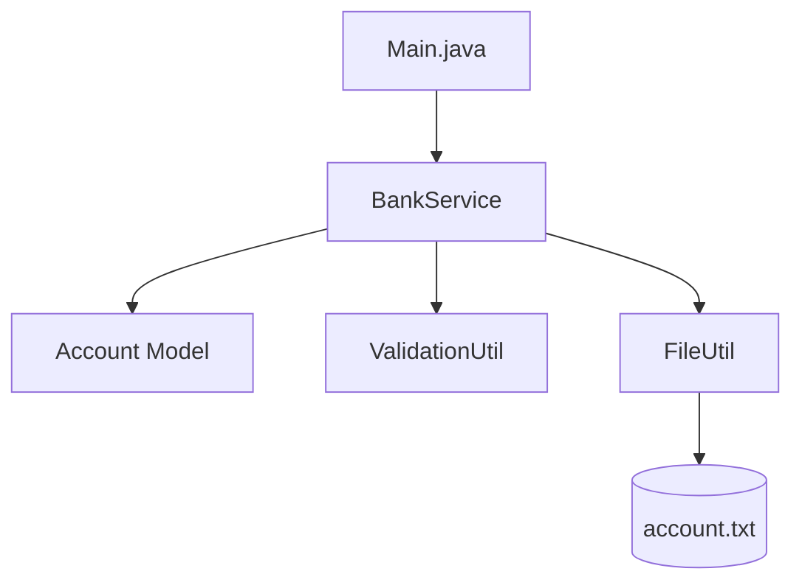

---

# 🔄 Application Workflow

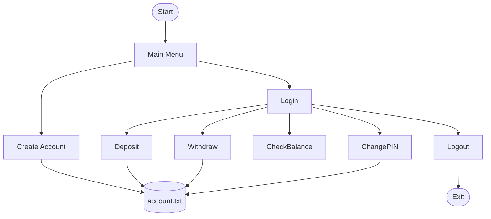

---

# 🎯 Main Objectives

- Learn Object-Oriented Programming
- Understand File Handling
- Implement Authentication
- Practice Real-World Logic
- Build Modular Java Applications
- Improve Problem Solving Skills

---

# 💾 Data Storage Format

Every account is stored inside:

```text
database/account.txt
```

Example:

```text
1001,Nitin Sharma,1234,5000.0,ACTIVE
1002,Rahul Kumar,4321,2500.0,INACTIVE
```

Each field represents:

| Field | Description |
|--------|-------------|
| Account Number | Unique ID |
| Holder Name | Customer Name |
| PIN | Login PIN |
| Balance | Current Balance |
| Status | ACTIVE / INACTIVE |

---

---

# 🏗 System Architecture

The project follows a layered architecture to keep the code clean and maintainable.

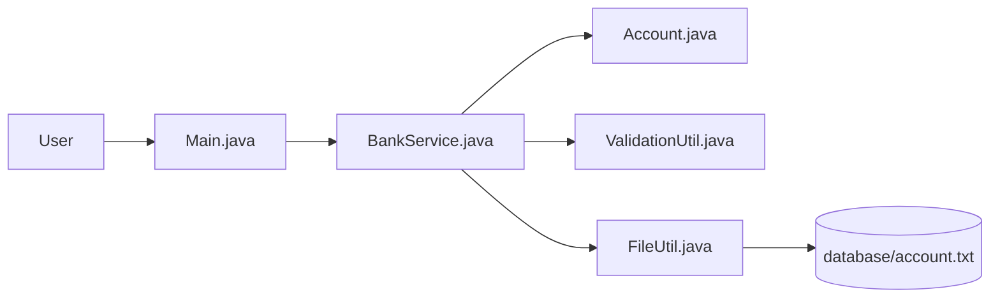

---

# 📚 Class Responsibilities

| Class | Responsibility |
|--------|----------------|
| Main | Displays menu and handles user choices |
| BankService | Contains complete banking business logic |
| Account | Represents bank account object |
| ValidationUtil | Validates user inputs |
| FileUtil | Provides file path management |

---

# 🔐 Login Authentication Flow

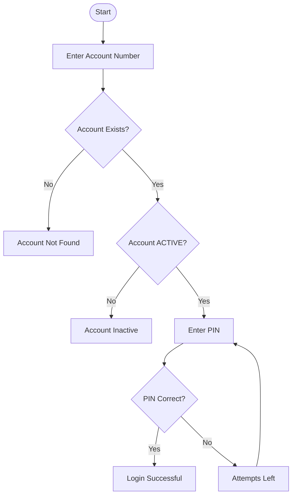

---

# 👤 Account Creation Flow

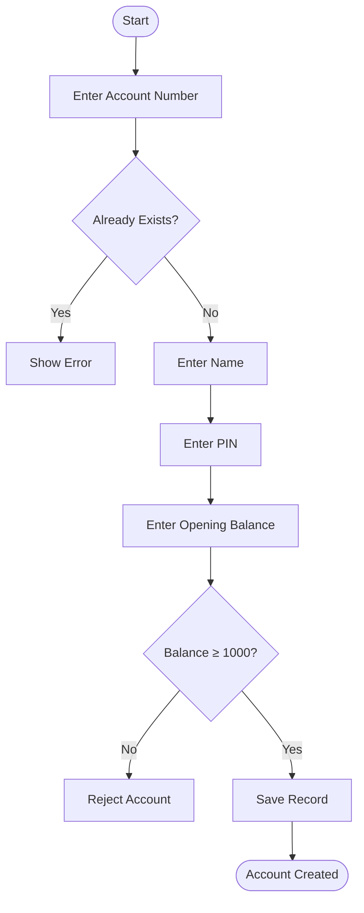

---

# 💰 Deposit Workflow

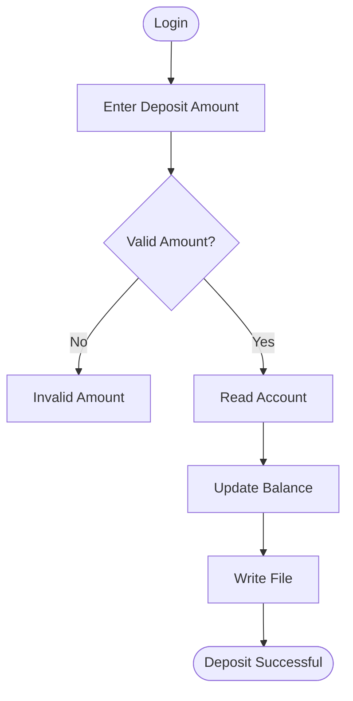

---

# 💸 Withdraw Workflow

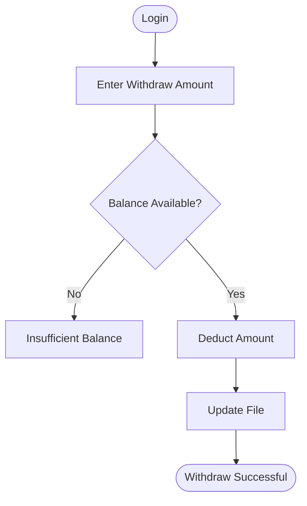

---

# 🔄 Account Life Cycle

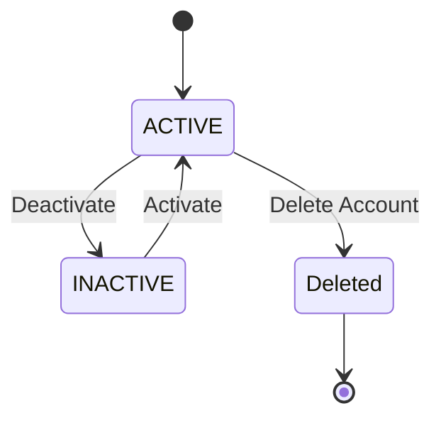

---

# 🗃 File Handling Process

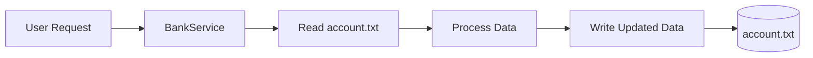

---

# 📂 Data Format

Each account record is stored in the following format:

```text
AccountNumber,AccountHolderName,PIN,Balance,Status
```

Example:

```text
1001,Nitin Sharma,1234,5000.0,ACTIVE
1002,Rahul Kumar,5678,2500.0,INACTIVE
```

---

# 🔒 Security Features

- PIN Authentication
- Session Management
- Login Required for Transactions
- Input Validation
- Account Status Verification
- Duplicate Account Prevention
- Minimum Opening Balance Validation
- File-Based Persistent Storage

---

---

# 👨‍💻 Use Case Diagram

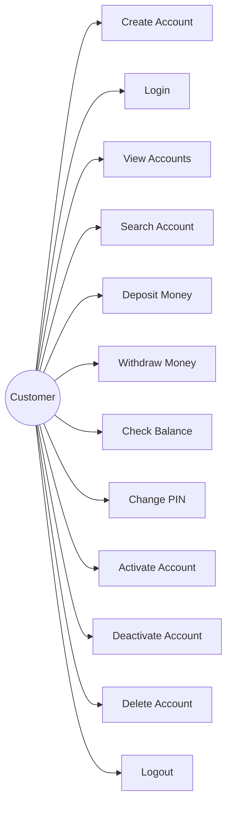

---

# 🔄 Complete Banking Workflow

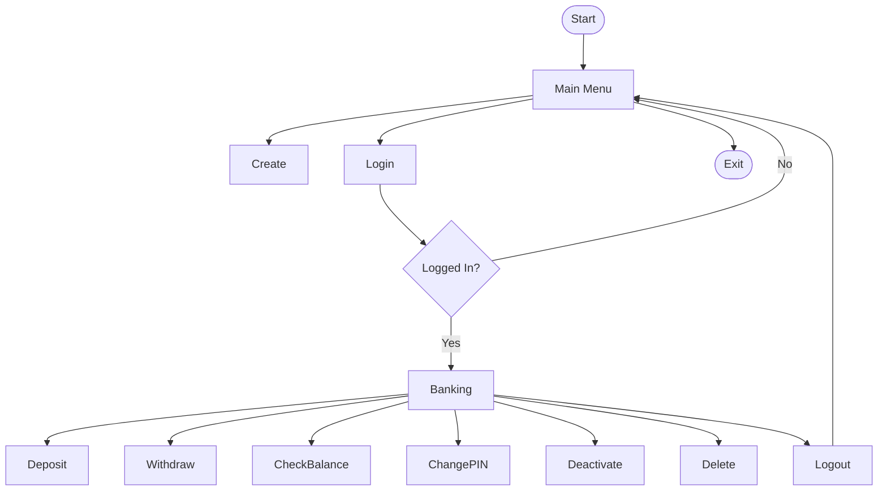

---

# 🔁 Sequence Diagram

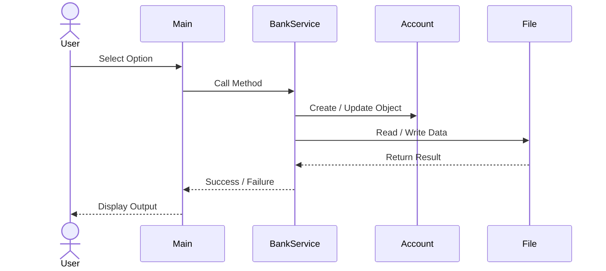

---

# 📖 Activity Diagram

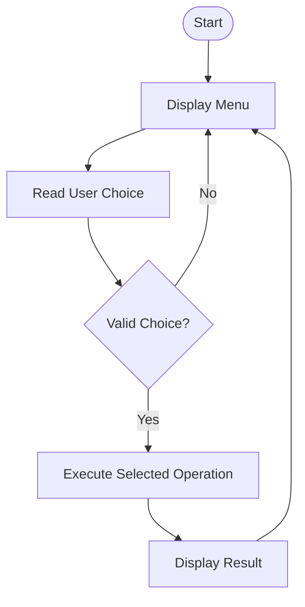

---

# 🧠 Object-Oriented Programming Concepts

| OOP Concept | Used In |
|-------------|----------|
| Class | Account, BankService |
| Object | Account Object |
| Encapsulation | Private Variables |
| Constructor | Account Constructors |
| Method | Deposit(), Withdraw(), Login() |
| Abstraction | Service Layer |
| Modular Programming | Package Structure |

---

# 📦 Java Packages

```text
main
│
└── Main.java

model
│
└── Account.java

service
│
└── BankService.java

util
│
├── FileUtil.java
└── ValidationUtil.java
```

---

# 🔍 Validation Rules

| Validation | Description |
|------------|-------------|
| Account Number | Cannot be Empty |
| Name | Alphabet Characters Only |
| PIN | Exactly 4 Digits |
| Opening Balance | Minimum ₹1000 |
| Deposit | Greater Than 0 |
| Withdraw | Greater Than 0 |
| Login | ACTIVE Account Only |

---

# 🔐 Authentication Process

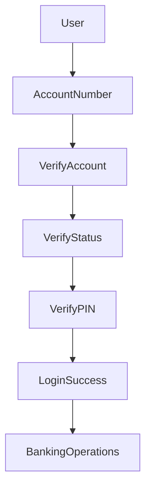

---

# 💾 File Update Logic

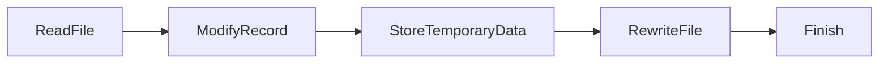

---

# ⚙ Software Design Principles Used

- Single Responsibility Principle
- Modular Programming
- Object-Oriented Design
- Separation of Concerns
- Reusable Utility Classes
- Secure Session Handling
- Input Validation
- Persistent File Storage

---

# 📈 Advantages of this Project

- Beginner Friendly
- Real Banking Logic
- Secure Login System
- Session Management
- File Handling
- Clean Package Structure
- Industry Style Coding
- Easy to Extend
- Good for Resume
- Good for Interviews

---

---

# 🧩 Component Diagram

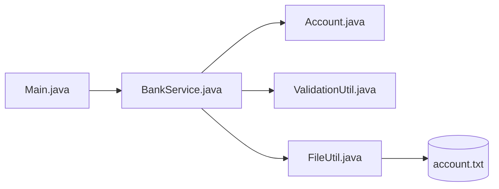

---

# 📊 Data Flow Diagram (DFD)

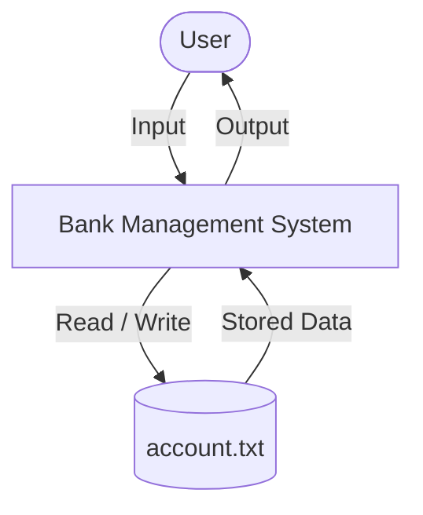

---

# 🧠 Banking Operations Mind Map

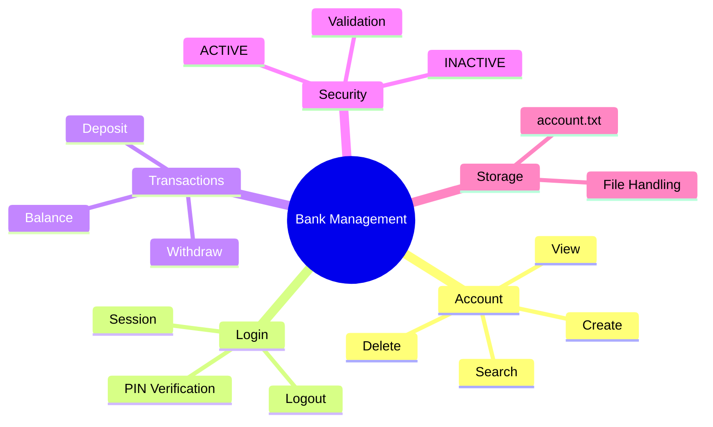

---

# 📦 Deployment Diagram

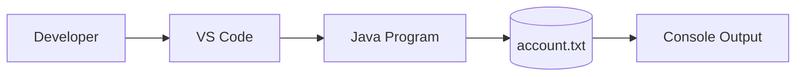

---

# 🔄 Account Status Flow

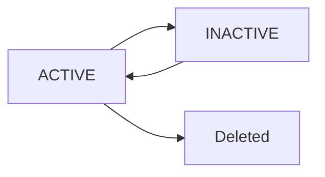

---

# 📂 Project Modules

| Module | Description |
|---------|-------------|
| Main | Controls program execution |
| Account | Stores account information |
| BankService | Handles banking operations |
| ValidationUtil | Validates user input |
| FileUtil | Manages file paths |
| account.txt | Stores all account records |

---

# ⚙ Functional Modules

| Function | Description |
|----------|-------------|
| Create Account | Opens a new bank account |
| Login | Authenticates customer |
| Deposit | Adds money |
| Withdraw | Removes money |
| Check Balance | Displays current balance |
| Change PIN | Updates account PIN |
| Activate | Activates inactive account |
| Deactivate | Deactivates account |
| Delete | Removes account permanently |
| Logout | Ends current session |

---

# 🔒 Validation Summary

✔ Valid Account Number

✔ Valid Name

✔ 4 Digit PIN

✔ Minimum ₹1000 Opening Balance

✔ Positive Deposit

✔ Positive Withdraw

✔ Active Account Verification

✔ Login Session Required

---

# 📁 File Handling Workflow

```mermaid
flowchart TD

Start([Start])

Start --> Read[Read account.txt]

Read --> Process[Process Data]

Process --> Update[Modify Records]

Update --> Save[Write account.txt]

Save --> End([Finish])
```

---

# 🚀 Future Improvements

- MySQL Database Integration

- JDBC Connectivity

- Password Encryption

- Transaction History

- Interest Calculation

- Money Transfer

- ATM Simulation

- Mini Statement

- GUI using Java Swing

- JavaFX Version

- Spring Boot REST API

- Online Banking System

- Mobile Banking Application

- Email Notifications

- OTP Verification

---

---

# 📸 Console Preview

## Main Menu

```text
========== BANK MANAGEMENT SYSTEM ==========

1. Create Account
2. View All Accounts
3. Search Account
4. Login
5. Deposit
6. Withdraw
7. Check Balance
8. Change PIN
9. Deactivate Account
10. Activate Account
11. Delete Account
12. Logout
13. Exit
```

---

# ▶️ How to Run

### Clone Repository

```bash
git clone https://github.com/nitinsharma9266/Java_Learning_Journey.git
```

---

### Open Project

```text
Bank_Management_System
```

---

### Compile

```bash
javac -d bin src/**/*.java
```

---

### Run

```bash
java main.Main
```

---

# 📋 Sample Account Record

```text
1001,Nitin Sharma,1234,5000.0,ACTIVE
```

---

---

# 📈 Project Statistics

| Category | Status |
|----------|--------|
| Language | Java |
| Architecture | OOP |
| Database | File Handling |
| Authentication | PIN Based |
| Session | Supported |
| Validation | Implemented |
| Account Status | ACTIVE / INACTIVE |
| Login Security | 3 Attempts |
| IDE | VS Code |
| Version Control | Git + GitHub |

---

# 🎯 Skills Demonstrated

- Object-Oriented Programming (OOP)

- Constructors

- Encapsulation

- Session Management

- Authentication

- File Handling

- BufferedReader

- BufferedWriter

- Exception Handling

- Input Validation

- Collections of Objects

- Business Logic Design

- Modular Programming

- Git

- GitHub

---

# 📚 Concepts Covered

✔ Classes & Objects

✔ Constructors

✔ Encapsulation

✔ Getter Methods

✔ Setter Methods

✔ File Handling

✔ Exception Handling

✔ Loops

✔ Conditional Statements

✔ Methods

✔ Packages

✔ Session Handling

✔ Validation

✔ Login Authentication

✔ CRUD Operations

---

# 🌟 Project Highlights

- Clean Code Structure

- Industry Style Folder Organization

- Reusable Utility Classes

- Secure Login System

- Modular Design

- Session Based Authentication

- Persistent Data Storage

- Easy to Maintain

- Beginner Friendly

- Resume Ready Project

---

# 🔮 Upcoming Improvements

- JDBC Integration

- MySQL Database

- Spring Boot REST API

- RESTful Services

- JavaFX GUI

- Admin Panel

- Transaction History

- Fund Transfer

- Interest Calculation

- ATM Simulation

- OTP Verification

- Email Alerts

- Mobile Banking

---

# 👨‍💻 Developer

**Nitin Sharma**

B.Tech Computer Science Engineering

Java Developer | App Developer

GitHub:
dssxxdj
GitHub: [@nitinsharma9266](https://github.com/nitinsharma9266)

---

# ⭐ Support

If you found this project useful, don't forget to ⭐ star this repository.

---

# 📜 License

This project is created for learning purposes.

You are free to use, modify and improve this project.

---

# 🙏 Thank You

Thank you for visiting this repository.

Happy Coding! ❤️
